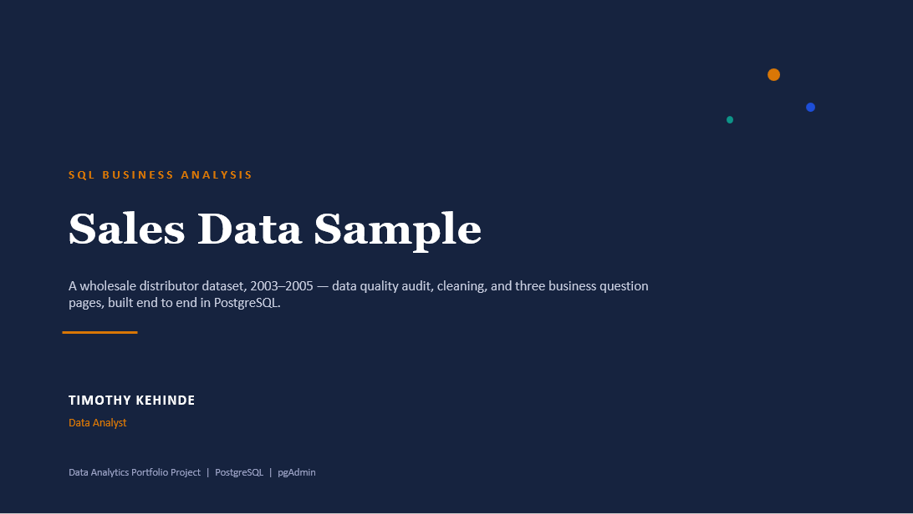
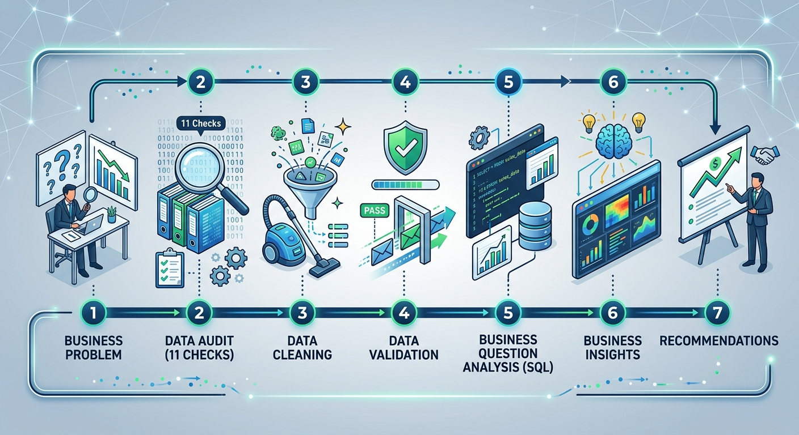
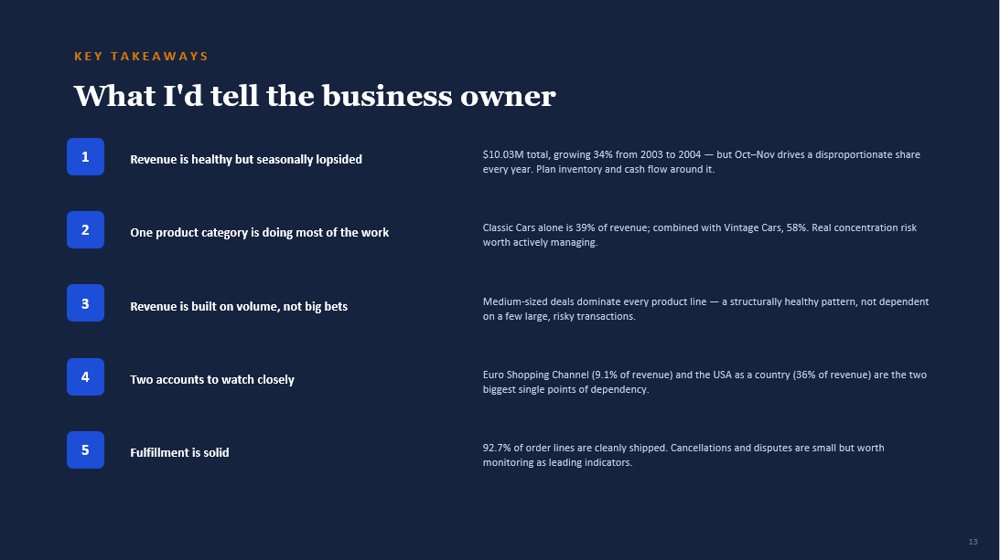

# Sales Data Sample — SQL Business Analysis

**Analyzed by:** Timothy Kehinde, Data Analyst

## 1. Project Overview

Businesses generate thousands of transactions across products, customers,
and regions, but without analysis they struggle to identify which products
actually drive revenue, which customers matter most, and where demand
concentrates seasonally.

This project analyzes a wholesale distributor dataset (2,823 order lines,
2003–2005) to uncover revenue trends, product performance, and customer and
territory concentration, using PostgreSQL end to end — audit, cleaning, and
analysis.

## 2. Business Problem

The business lacked visibility into where its revenue actually comes from
and how much risk sits in a small number of products, customers, and
markets.
Decision-makers needed clear answers on seasonal demand patterns,
category concentration, and customer/geographic dependency to plan
inventory, protect key accounts, and reduce risk.

## 3. Core Business Questions

- Which months and quarters drive the most revenue, and is there a
  seasonal pattern?
- How healthy is order fulfillment — how much revenue is cancelled,
  disputed, or stuck in process?
- Which products and product lines generate the most revenue?
- Is revenue concentrated in a few products, or spread across the catalog?
- Are products selling above or below their listed MSRP?
- Who are the top customers, and how much of total revenue do they
  represent?
- Which territories and countries drive the most revenue, and where is
  that revenue actually concentrated?

## 4. Dataset

| Item | Details |
|---|---|
| Dataset | Sales Data Sample (wholesale distributor transactions) |
| Records | 2,823 order lines |
| Variables | 25 columns |
| Period | January 2003 – May 2005 |
| Grain | One row per product per order (order lines) |

## 5. Data Quality Assessment

| Issue | Action |
|---|---|
| Missing ADDRESSLINE2 (89%) | Left as null — structurally optional field, not a defect |
| Missing STATE (64%) | Left as null — only used by USA, Australia, Canada, Japan |
| Missing POSTALCODE (2.7%) | Left as null — traced to 3 specific customers, documented |
| Duplicate records | None found — composite key confirmed unique |
| Inconsistent text casing | Corrected with INITCAP on customer, city, and contact name fields |
| Inconsistent PHONE formatting | Standardized to digits + plus sign only |
| Invalid PRICEEACH (46% flat placeholder value) | Added PRICEEACH_CORRECTED column, recalculated as SALES ÷ QUANTITYORDERED |
| Statistical outliers in SALES/QUANTITYORDERED | Reviewed via IQR method, retained — legitimate large wholesale orders |

## 6. Analysis Workflow

**Business Problem** — Defined what the business owner actually needed to
know: where revenue concentrates, how healthy fulfillment is, and how much
risk sits in a small number of products, customers, and markets.

**Data Audit (11 checks)** — Before touching any business question, ran a
full check on the raw data, which includes: 
1. structural overview
2. null / missing value audit
3. duplicate check
4. cardinality / distinct value counts
5. category value lists (to spot inconsistent formatting)
6. range checks on numeric fields
7. missing values in every affected column, and
8. cross-field validation (sales vs quantityordered x priceeach) sales.
This last check is what surfaced the project's most significant
finding — PRICEEACH stuck at a flat placeholder value in 46% of rows.

**Data Cleaning** — Acted on what the audit found. Left structurally
explained nulls untouched (ADDRESSLINE2, STATE, POSTALCODE), standardized
text casing and phone formatting, and built a corrected pricing column
(PRICEEACH_CORRECTED) rather than silently overwriting the flawed source
field — so the original defect stays visible and auditable.

**Data Validation** — Re-checked the cleaned dataset before moving into
analysis: confirmed zero duplicates remained, verified corrected prices
against known-affected rows, and reviewed statistical outliers in SALES and
QUANTITYORDERED individually (using the IQR method)
" IQR (interquartile range) is a standard statistical method that flags
values sitting unusually far outside the typical range of the data —
used here instead of guessing a cutoff by eye. " before deciding to keep
them as legitimate large wholesale orders rather than errors.

**Business Question Analysis (SQL)** — Answered three groups of business
questions directly in PostgreSQL: 
1. revenue and sales trends (yearly, monthly, quarterly, month-over-month growth, order status),
2. top products and productlines (best sellers, category concentration, deal size, price vs MSRP)
3. top customers and territories (customer concentration, territory andcountry-level revenue).

**Business Insights** — Turned each query result into a plain-language
finding, cross-checking numbers against each other where needed — for
example, confirming the November revenue spike was backed by real order
volume, not a handful of oversized orders skewing the total.

**Recommendations** — Converted every insight into a specific, actionable
next step for the business owner, distinguishing between findings solid
enough to act on now (the Oct–Nov seasonal surge, the Classic Cars
concentration) and findings that need more data before acting.

## 7. Analytical Approach

**Data Audit**
- Structural overview, duplicate check, cardinality, category consistency,
  numeric range checks
- Missing value investigation, field by field, with root cause traced
  rather than just flagged
- Cross-field validation (SALES vs QUANTITYORDERED × PRICEEACH) — this is
  what surfaced the PRICEEACH defect

**Data Cleaning**
- Left structurally-explained nulls untouched (ADDRESSLINE2, STATE,
  POSTALCODE)
- Standardized text casing and phone formatting
- Built a corrected pricing column rather than overwrite the flawed source
  field, preserving auditability
- Reviewed statistical outliers individually before deciding to retain them

**SQL Analysis**
- Revenue and sales trends (yearly, monthly, quarterly, month-over-month
  growth, order status)
- Top products and product lines (best sellers, category concentration,
  deal size distribution, price vs MSRP)
- Top customers and territories (customer concentration, territory and
  country-level revenue)

## 8. Key Insights

✔ November revenue runs 3–4x above a typical month in both 2003 and 2004,
backed by genuinely elevated order volume — not a few oversized orders.

✔ Classic Cars alone drives 39.07% of total revenue; combined with Vintage
Cars, the two car-related lines account for 58% of total business revenue.

✔ Euro Shopping Channel is the single largest customer, generating
approximately 9.1% of total company revenue from just 26 orders.

✔ The USA alone generates 36% of total company revenue — more than 3x the
next-largest country — making it the single greatest country-level
concentration risk, even though EMEA leads at the broader territory level.

✔ 92.7% of order lines are cleanly shipped, and medium-sized deals drive
revenue across every product line without exception — both signs of a
structurally healthy revenue base underneath the concentration risks above.

## 9. Business Recommendations

Here's what I'd actually tell the business owner, backed by what the data
showed.

**Seasonality.** November revenue runs 3–4x above a typical month, in both
2003 and 2004, backed by genuinely elevated order volume, not a few large
orders. Recommendation: align inventory planning, staffing, and cash flow
forecasting around the October–November surge, and consider early-bird
incentives to shift some of that volume earlier for a smoother operational
load.

**Order fulfillment.** 92.7% of order lines are cleanly shipped — the
business is fundamentally healthy. Cancelled orders are small (1.9% of
revenue) but worth monitoring as a leading indicator if that rate trends
upward. Recommendation: track disputed orders specifically against product
and customer to see if they cluster — disputes usually signal a service or
quality issue, not just a change of mind.

**Product concentration.** Classic Cars alone drives 39.07% of revenue, and
together with Vintage Cars accounts for 58% — real concentration risk.
Trains is the smallest category by far, 2.26% from only 3 SKUs.
Recommendation: prioritize supply chain resilience and inventory planning
specifically for Classic and Vintage Cars, since any disruption there would
have outsized impact. Worth evaluating whether growing Ships, Trucks and
Buses, or Planes is a strategic priority to reduce that dependency — and
whether Trains is still worth maintaining, though that call needs margin
data this dataset doesn't have.

**Deal size.** Medium-sized deals dominate revenue across every product
line without exception — a structurally healthy pattern, not dependent on a
handful of large, high-risk deals. Recommendation: no action needed here,
but worth flagging as a strength when discussing revenue stability with
stakeholders.

**Pricing vs MSRP.** Most product lines sell above their listed MSRP, most
notably Trains (+$11.12). Classic Cars is the one exception, selling below
MSRP, likely reflecting volume discounting on the top category.
Recommendation: clarify with the business whether MSRP here represents a
wholesale baseline or a retail list price — the current pattern (selling
above MSRP almost everywhere) is unusual enough to be worth confirming
before using it in any pricing strategy.

**Customer concentration.** Euro Shopping Channel alone is 9.1% of total
revenue; the top 10 customers combined are 29.45%. Recommendation:
prioritize retention and relationship management for Euro Shopping Channel
specifically, and keep active account management across the full top-10
group — not extreme concentration, but enough to actively manage rather
than ignore.

**Geographic concentration.** EMEA leads at the territory level through
breadth across many markets, but the USA alone is 36% of total revenue —
the company's single greatest country-level concentration risk.
Recommendation: monitor for USA-specific market risk given that
concentration, and evaluate whether targeted growth investment in APAC and
Japan (currently just 12% combined) is worth pursuing to reduce long-term
dependency on the USA and EMEA.

## 10. Tools Used

PostgreSQL · pgAdmin · SQL (joins, CTEs, window functions, aggregates, IQR
outlier detection)

## 11. Skills Demonstrated

Data Quality Auditing · Data Cleaning · Root Cause Investigation · SQL
Querying · Business Problem Solving · Trend & Seasonality Analysis ·
Customer & Market Concentration Analysis · Business Storytelling

## 12. Repository Structure

| File | What it covers |
|---|---|
| [`01_data_audit.sql`](./01_data_audit.sql) | Full data quality audit, all 11 checks with inline findings |
| [`Data_Auditing_Summary.txt`](./Data_Auditing_Summary.txt) | Written summary of every audit check and its verdict |
| [`02_data_cleaning.sql`](./02_data_cleaning.sql) | Full cleaning process: missing values, duplicates, standardization, validation |
| [`Data_Cleaning_Summary.txt`](./Data_Cleaning_Summary.txt) | Written cleaning summary table |
| [`Data_Dictionary.txt`](./Data_Dictionary.txt) | Column by column reference: data type and business meaning |
| [`03a_revenue_sales_trends.sql`](./03a_revenue_sales_trends.sql) | Business Question Page 1: revenue, seasonality, order status |
| [`03b_top_products_productlines.sql`](./03b_top_products_productlines.sql) | Business Question Page 2: top products, category concentration, pricing |
| [`03c_top_customers_territories.sql`](./03c_top_customers_territories.sql) | Business Question Page 3: top customers, territory and country concentration |
| [`Business_Question_and_Insights.txt`](./Business_Question_and_Insights.txt) | Full written insights for all three business question pages |
| [`sales_data_sample.csv`](./sales_data_sample.csv) | Source dataset |

---

**Timothy Kehinde**
Data Analyst
